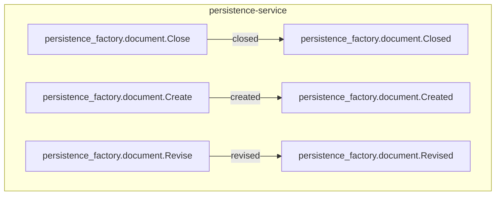

<!--
generated from persistence_factory v1
model digest 1f61c237f551ba7dd92f1e22a17ff302e51a365f030c9f9d37a2537432687e82
contract digest f081c5ffdabfff6b3ae5575185f94353ca8257af37615780abd6a5b7cde7495d
do not edit: regenerate with `ess generate`
-->

# persistence_factory v1

## The system as a graph

A command is accepted by the component that owns its context, emits the events one of its outcomes declares, and a dashed edge is a binding carrying an event into the next command. Design §9 begins one step earlier, at the actor who invokes the first command, and so does this graph: a solid edge out of an actor is a grant, and an actor drawn with no edge at all may invoke nothing — which is something the model says, not an arrow somebody forgot.

## Bounded contexts

- **[document](domains/persistence_factory-document.md)** (`persistence_factory.document`) Five types, one entity, one view, three commands, three events, no errors and no actors.

## Components

A component is a unit of ownership, not a deployment. How many of each runs, and what each needs, is [the topology](topology.md).

**`persistence-service`** — SDK-owned persistence proof documents. It owns [`persistence_factory.document`](domains/persistence_factory-document.md). It accepts `persistence_factory.document.Close`, `persistence_factory.document.Create` and `persistence_factory.document.Revise`. It publishes `persistence_factory.document.Closed`, `persistence_factory.document.Created` and `persistence_factory.document.Revised`.

## The other pages

| page | what is on it |
|---|---|
| [document](domains/persistence_factory-document.md) | the `persistence_factory.document` vocabulary: its types, entities, views, commands, events, errors and actors |
| [Interactions](interactions.md) | every binding, with what it guarantees and what happens when it fails |
| [Type crossings](crossings.md) | every conversion this system permits, and the reason someone gave for it |
| [Topology](topology.md) | what each component needs in order to run |

---

Generated from persistence_factory v1 · model digest `1f61c237f551ba7dd92f1e22a17ff302e51a365f030c9f9d37a2537432687e82` · contract digest `f081c5ffdabfff6b3ae5575185f94353ca8257af37615780abd6a5b7cde7495d`. Do not edit this file; change the specification and regenerate it with `ess generate`.
