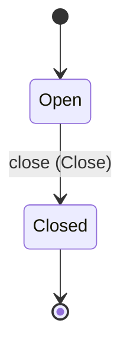

<!--
generated from persistence_http v1
model digest 6e8c2aa44b4c1cecbd05e6c66fefb0a44d64ece7d9c87bfbc727e9a80d42fe46
contract digest slice-sha256/2:3d0faab36c842042317c0500936ab21cc2bf15e3f727183b029fa1f6dfbd2185
do not edit: regenerate with `ess generate`
-->

# document

`persistence_http.document` is one of persistence_http's bounded contexts. [Back to the index](../index.md).

## Types

### `ContentRef`

`persistence_http.document.ContentRef` wraps `String` and is not interchangeable with one: the whole value of naming it separately is the crossings the model then refuses.

### `Id`

`persistence_http.document.Id` wraps `Uuid` and is not interchangeable with one: the whole value of naming it separately is the crossings the model then refuses.

### `Owner`

`persistence_http.document.Owner` wraps `String` and is not interchangeable with one: the whole value of naming it separately is the crossings the model then refuses.

### `Row`

`persistence_http.document.Row` is a record of five fields:

- `id` — `persistence_http.document.Id`
- `revision` — `persistence_http.document.Id`
- `owner` — `persistence_http.document.Owner`
- `scopes` — `persistence_http.document.Scopes`
- `content_ref` — `persistence_http.document.ContentRef`

### `Scopes`

`persistence_http.document.Scopes` is a record of one field:

- `team` — `Optional<String>`, which may be absent

One of the types above is reached by nothing else in this system: `persistence_http.document.Row`. No entity, view, command, event, error or crossing names it, so it is either vocabulary something outside this specification uses or a leftover — and only a person can tell which.

## Entities

An entity is what this context is about: something with an identity that outlives any one request, a shape, and a lifecycle. The lifecycle is exhaustive — a move that is not drawn below is a move this specification does not permit, and that is the only way it says so. Every move is labelled with the command that takes it, because a move nothing can trigger is refused rather than drawn.

### `Document`

`persistence_http.document.Document`.

An instance is identified by `id`, a `persistence_http.document.Id`. The name is part of the model and not a convention: a view projects the identity under that name, so a projection inventing its own would disagree with the view.

It holds:

- `revision` — `persistence_http.document.Id`
- `owner` — `persistence_http.document.Owner`
- `scopes` — `persistence_http.document.Scopes`
- `content_ref` — `persistence_http.document.ContentRef`

It declares no relation to another entity, and no other entity names it.

No invariant is declared, so nothing here constrains an instance at rest.

Its state is a `persistence_http.document.Document.State`, one of `Closed` and `Open`. That enum is synthesised from the lifecycle rather than declared beside it, so the states a view's filter compares and the states drawn below cannot disagree.

An instance is created in `Open`. `Closed` is terminal, so an instance may rest there forever. That is declared rather than inferred from having no way out: an entity that cannot leave a state is either finished or stuck, and only its author knows which.

Each move is taken by a declared command outcome, and a move nothing takes is refused as `missing_causation` rather than left as a state change nobody can trigger:

- `close` — taken by `persistence_http.document.Close` on its `closed` outcome

An instance is brought into existence by `persistence_http.document.Create` on its `created` outcome.

Illegal transitions are illegal by absence: no rule forbids them, there is simply no arrow, because a rule would be a second place for the same truth to live. A diagram cannot show an absence, so the pairs it does not connect are listed here, derived from the same transitions — anything named below is a move this specification does not permit.

- `Closed` may not become `Open`

One view projects it: [`ById`](#byid).

## Views

A view is what the outside world is promised it can observe. Each one says which instances it contains and how soon it reflects a command that has already returned, because "you can read this" without "how soon" is the promise every flaky suite is built on.

### `ById`

`persistence_http.document.ById`.

It reads [`Document`](#document).

It contains every instance of that entity: no filter narrows it, which is a decision somebody made and not a line somebody omitted.

It exposes:

- `id` — `persistence_http.document.Id`
- `revision` — `persistence_http.document.Id`
- `owner` — `persistence_http.document.Owner`
- `scopes` — `persistence_http.document.Scopes`
- `content_ref` — `persistence_http.document.ContentRef`

It declares no order, so the rows come back in whatever order the implementation has, and two reads may disagree.

**Read-your-writes**: it is current the moment the command that changed it returns. A caller that has just created an invoice and cannot see it in here has been told a lie about what it did.

A generated scenario asserts it once, immediately after the command: a view promising this and not keeping the promise has to fail the suite rather than be retried until it passes.

## Commands

### `Close`

`persistence_http.document.Close`.

It takes:

- `id` — `persistence_http.document.Id`

It has one outcome.

**`closed`** — The default branch, taken when no other outcome's condition matched. It moves a `persistence_http.document.Document` from `Open` to `Closed`, along the declared move `close`. The instance is the one named by the input field `id`. It emits `persistence_http.document.Closed`. A test reaches it by constructing an input that satisfies no other outcome's condition.

### `Create`

`persistence_http.document.Create`.

It takes:

- `content_ref` — `persistence_http.document.ContentRef`
- `scopes` — `persistence_http.document.Scopes`

It has one outcome.

**`created`** — The default branch, taken when no other outcome's condition matched. It creates a `persistence_http.document.Document`, which starts in `Open`. The new instance's identity is published as `id` on `persistence_http.document.Created`. It emits `persistence_http.document.Created`. A test reaches it by constructing an input that satisfies no other outcome's condition.

### `Revise`

`persistence_http.document.Revise`.

It takes:

- `id` — `persistence_http.document.Id`

It has one outcome.

**`revised`** — The default branch, taken when no other outcome's condition matched. It changes a `persistence_http.document.Document` without moving it along its lifecycle. The instance is the one named by the input field `id`. It emits `persistence_http.document.Revised`. A test reaches it by constructing an input that satisfies no other outcome's condition.

## Events

### `Closed`

`persistence_http.document.Closed`.

It carries:

- `id` — `persistence_http.document.Id`
- `revision` — `persistence_http.document.Id`

Emitted by `persistence_http.document.Close` on its `closed` outcome.

Nothing in this system reacts to it.

### `Created`

`persistence_http.document.Created`.

It carries:

- `id` — `persistence_http.document.Id`
- `revision` — `persistence_http.document.Id`
- `owner` — `persistence_http.document.Owner`
- `scopes` — `persistence_http.document.Scopes`
- `content_ref` — `persistence_http.document.ContentRef`

Emitted by `persistence_http.document.Create` on its `created` outcome.

Nothing in this system reacts to it.

### `Revised`

`persistence_http.document.Revised`.

It carries:

- `id` — `persistence_http.document.Id`
- `revision` — `persistence_http.document.Id`

Emitted by `persistence_http.document.Revise` on its `revised` outcome.

Nothing in this system reacts to it.

---

Generated from persistence_http v1 · model digest `6e8c2aa44b4c1cecbd05e6c66fefb0a44d64ece7d9c87bfbc727e9a80d42fe46` · contract digest `slice-sha256/2:3d0faab36c842042317c0500936ab21cc2bf15e3f727183b029fa1f6dfbd2185`. Do not edit this file; change the specification and regenerate it with `ess generate`.
