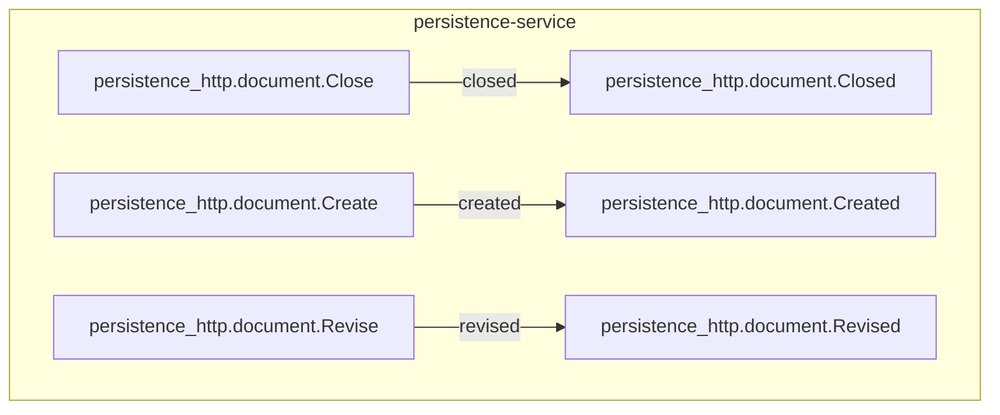

<!--
generated from persistence_http v1
model digest 6e8c2aa44b4c1cecbd05e6c66fefb0a44d64ece7d9c87bfbc727e9a80d42fe46
contract digest 3d0faab36c842042317c0500936ab21cc2bf15e3f727183b029fa1f6dfbd2185
do not edit: regenerate with `ess generate`
-->

# persistence_http v1

## The system as a graph

A command is accepted by the component that owns its context, emits the events one of its outcomes declares, and a dashed edge is a binding carrying an event into the next command. Design §9 begins one step earlier, at the actor who invokes the first command, and so does this graph: a solid edge out of an actor is a grant, and an actor drawn with no edge at all may invoke nothing — which is something the model says, not an arrow somebody forgot.

## Bounded contexts

- **[document](domains/persistence_http-document.md)** (`persistence_http.document`) Five types, one entity, one view, three commands, three events, no errors and no actors.

## Components

A component is a unit of ownership, not a deployment. How many of each runs, and what each needs, is [the topology](topology.md).

**`persistence-service`** — SDK-owned persistence proof documents. It owns [`persistence_http.document`](domains/persistence_http-document.md). It accepts `persistence_http.document.Close`, `persistence_http.document.Create` and `persistence_http.document.Revise`. It publishes `persistence_http.document.Closed`, `persistence_http.document.Created` and `persistence_http.document.Revised`.

## The other pages

| page | what is on it |
|---|---|
| [document](domains/persistence_http-document.md) | the `persistence_http.document` vocabulary: its types, entities, views, commands, events, errors and actors |
| [Interactions](interactions.md) | every binding, with what it guarantees and what happens when it fails |
| [Type crossings](crossings.md) | every conversion this system permits, and the reason someone gave for it |
| [Topology](topology.md) | what each component needs in order to run |

---

Generated from persistence_http v1 · model digest `6e8c2aa44b4c1cecbd05e6c66fefb0a44d64ece7d9c87bfbc727e9a80d42fe46` · contract digest `3d0faab36c842042317c0500936ab21cc2bf15e3f727183b029fa1f6dfbd2185`. Do not edit this file; change the specification and regenerate it with `ess generate`.
